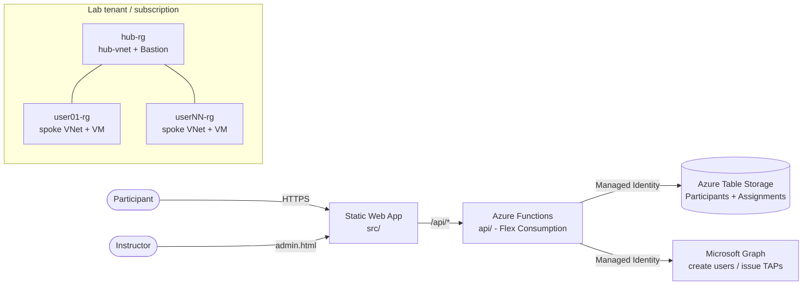

# Azure IaaS Training Workshop

A reusable, instructor-led workshop hub for delivering hands-on **Azure IaaS
fundamentals** training. It provides a participant web app that walks each
attendee through three hands-on Azure labs (Networking → Peering → Compute, plus
an optional Storage bonus), tracks their progress in real time, and gives the
instructor a live dashboard to monitor cohort readiness.

The app is intentionally generic so colleagues can fork it, change a handful of
configuration values, and re-deliver the same workshop to their own customers.

> **Disclaimer:** This is community sample content, not an official Microsoft
> product. It is provided "as is" under the [MIT License](LICENSE) with no
> warranty or support. Review and adapt it for your own environment before use.

---

## Architecture



- **Frontend** (`src/`) — static HTML/CSS/vanilla JS, no build step, hosted on
  **Azure Static Web Apps** (Standard).
- **API** (`api/`) — **Azure Functions** v4 (Node.js 20, Flex Consumption),
  linked to the Static Web App for same-origin `/api/*` routing (no CORS).
- **Data** — **Azure Table Storage** (`Participants`, `Assignments`), accessed
  via a user-assigned managed identity (no connection strings).
- **Identity** — the same managed identity calls **Microsoft Graph** to create
  per-participant Entra ID users and issue Temporary Access Passes (TAPs).
- **Lab topology** — a shared `hub-rg` (hub VNet + Azure Bastion) and one
  `userNN-rg` spoke resource group per participant, each scoped with least-
  privilege RBAC.
- **Infrastructure** — **Bicep** orchestrated by the **Azure Developer CLI
  (azd)**, plus PowerShell scripts in `infra/` for per-cohort lifecycle tasks.

---

## Prerequisites

| Requirement | Notes |
|---|---|
| Azure subscription | You need Owner/Contributor + User Access Administrator to assign RBAC. |
| Microsoft Entra tenant | With **Temporary Access Pass** enabled, and rights to create users. |
| [Azure CLI](https://learn.microsoft.com/cli/azure/install-azure-cli) | `az` |
| [Azure Developer CLI](https://learn.microsoft.com/azure/developer/azure-developer-cli/install-azd) | `azd` |
| [Azure Functions Core Tools v4](https://learn.microsoft.com/azure/azure-functions/functions-run-local) | for local API work |
| Node.js 20.x | for the Functions API |
| PowerShell 7.x | for the `infra/` scripts |
| `Az` PowerShell module 12.x | `Install-Module Az -Scope CurrentUser` |
| `Microsoft.Graph` module 2.x | `Install-Module Microsoft.Graph -Scope CurrentUser` |

---

## Quick start

1. **Fork / clone** this repository.

2. **Edit the per-delivery config** in [`src/config.js`](src/config.js):
   `sessionId`, `sessionName`, `sessionDate`, and `sessionCode`.

3. **Deploy the app infrastructure** with azd (creates `workshop-app-rg` with
   the Static Web App, Functions app, storage, and managed identity):

   ```powershell
   azd up
   ```

4. **Grant the managed identity Microsoft Graph permissions** (one-time, idempotent):

   ```powershell
   .\infra\grant-graph-permissions.ps1 -TenantId <YOUR_TENANT_ID>
   ```

5. **Deploy the hub and spoke topology**, then **seed a cohort** (creates users,
   assigns RBAC, issues TAPs). See [`infra/README.md`](infra/README.md) for the
   full one-time-setup and per-cohort lifecycle.

6. **Run the workshop**, then tear down the cohort with
   `.\infra\teardown-cohort.ps1` (the app infrastructure stays warm for the next
   cohort). See [`docs/ops-runbook.md`](docs/ops-runbook.md).

---

## Values you must change

Replace these placeholder tokens (used throughout `docs/` and `infra/`) with
values from **your** deployment:

| Token | What it is | Where it comes from |
|---|---|---|
| `<YOUR_TENANT_ID>` | Entra tenant ID | `az account show --query tenantId` |
| `<TENANT_DOMAIN>` | e.g. `contoso.onmicrosoft.com` | your Entra tenant |
| `<YOUR_SUBSCRIPTION_NAME>` / `<SUBSCRIPTION_ID>` | target subscription | `az account show` |
| `<SWA_HOSTNAME>` | Static Web App hostname | `azd` output / portal |
| `<FUNCTION_APP_NAME>` | Functions app name | `azd` output / portal |
| `<STORAGE_ACCOUNT_NAME>` | Table Storage account | `azd` output / portal |
| `<UAMI_CLIENT_ID>` | managed identity client ID | `azd` output / portal |
| `<ADMIN_ACCESS_CODE>` | instructor dashboard code | Function App setting `ADMIN_ACCESS_CODE` |
| `<SESSION_CODE>` | participant join code | `src/config.js` + Function App setting `SESSION_CODE` |
| `<AZD_ENV>` | your azd environment name | `azd env list` |

Per-delivery app config lives in [`src/config.js`](src/config.js). Per-cohort
infrastructure parameters are documented in [`infra/README.md`](infra/README.md).

---

## Cost

After a soft teardown (between cohorts), only the app infrastructure remains:
Static Web App (Standard, ~$9/mo), Functions on Flex Consumption (near-zero at
idle), Table Storage and Application Insights (negligible). Spoke VMs/VNets and
Azure Bastion are the main per-cohort costs — delete them promptly after each
delivery. Run `azd down` for a full teardown to ~$0 idle.

---

## Security notes

- **Never commit secrets.** `api/local.settings.json`, `.env`, and the `.azure/`
  folder are gitignored. Use [`api/local.settings.sample.json`](api/local.settings.sample.json)
  as a template.
- **Rotate `SESSION_CODE`** each delivery; keep `ADMIN_ACCESS_CODE` secret and do
  not rotate it mid-event.
- **TAPs** are short-lived (8 hours, multi-use) and can be rotated from the admin
  dashboard or via `infra/rotate-all-taps.ps1`.
- Participants get least-privilege RBAC: Contributor on their own `userNN-rg`,
  Reader on `hub-rg`, plus a narrow custom role for hub peering.

---

## Repository layout

| Path | Contents |
|---|---|
| `src/` | Static Web App — participant pages, admin dashboard, `config.js` |
| `api/` | Azure Functions API (Node.js) |
| `infra/` | Bicep templates + PowerShell lifecycle scripts ([README](infra/README.md)) |
| `docs/` | Implementation plan, website plan, ops runbook, instructor scripts |

---

## Contributing & support

See [CONTRIBUTING.md](CONTRIBUTING.md) and [SECURITY.md](SECURITY.md). Issues and
pull requests are welcome, but remember this is unsupported sample content.

## License

[MIT](LICENSE)
